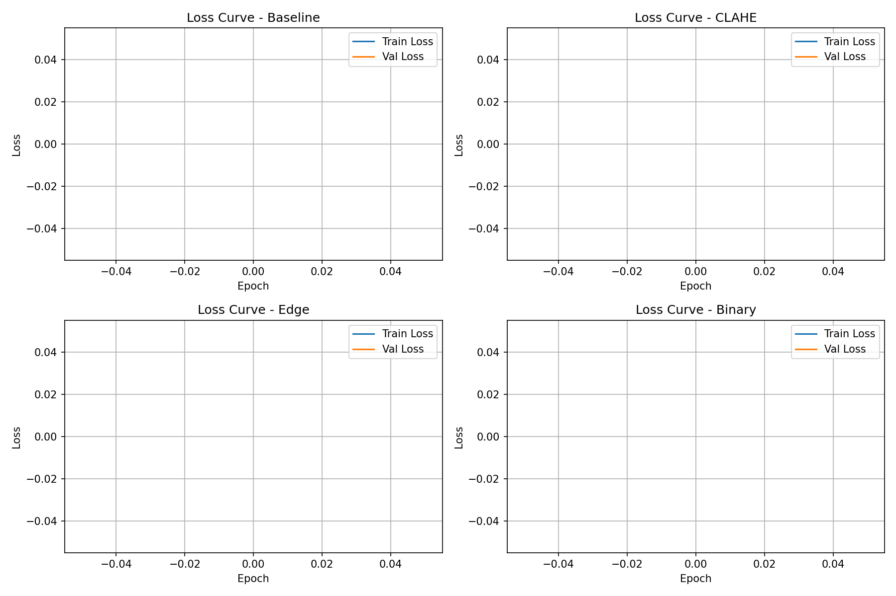
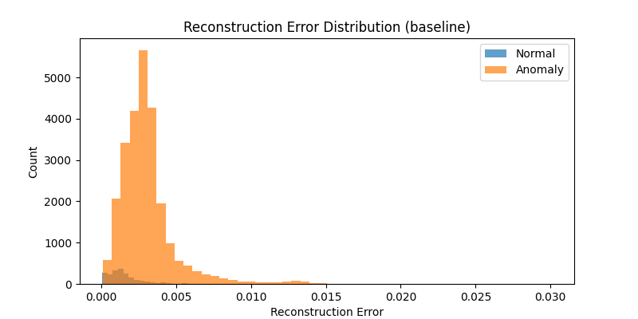
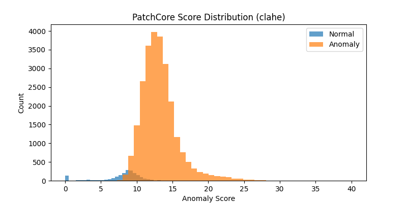

# WM-811K 웨이퍼 이상탐지 | 전처리 방법 비교 실험

## 프로젝트 개요

WM-811K 데이터셋을 활용하여 반도체 웨이퍼 맵에서 정상 웨이퍼와 불량 웨이퍼를 탐지하는 이상탐지 모델을 구현합니다.
정상 데이터만으로 학습하여 불량 패턴을 탐지하는 비지도 이상탐지 방식을 채택하며,
전처리 방법(CLAHE, 이진화, Canny Edge)과 모델(AutoEncoder, PatchCore)에 따른 성능 변화를 비교 실험합니다.

- GitHub: [wafer-anomaly-detection](https://github.com/su0907/wafer-anomaly-detection)

## 데이터셋

- 출처: [WM-811K (Kaggle)](https://www.kaggle.com/datasets/qingyi/wm811k-wafer-map)
- 전체 811,457개 중 라벨링된 데이터 사용
- 학습: None(정상) 데이터 10,000개 사용
- 테스트: 불량 패턴 전체 25,519개 사용

### 클래스별 데이터 분포

| 클래스 | 데이터 수 | 비율 | 용도 |
|--------|-----------|------|------|
| None | 785,938 | 96.87% | 학습 (10,000개 샘플링) |
| Edge-Ring | 9,680 | 1.19% | 테스트만 |
| Edge-Loc | 5,189 | 0.64% | 테스트만 |
| Center | 4,294 | 0.53% | 테스트만 |
| Loc | 3,593 | 0.44% | 테스트만 |
| Scratch | 1,193 | 0.15% | 테스트만 |
| Random | 866 | 0.11% | 테스트만 |
| Donut | 555 | 0.07% | 테스트만 |
| Near-full | 149 | 0.02% | 테스트만 |

### 데이터 분할

- Train: None(정상) 10,000개
- Validation: Train의 20% (2,000개)
- Test: 불량 전체 25,519개 + 정상 2,000개

## 전처리 비교 실험

웨이퍼 이미지 특성에 맞는 전처리 방법을 비교하여 이상탐지 성능에 미치는 영향을 분석합니다.

| 실험 | 전처리 방법 | 설명 |
|------|------------|------|
| Exp-A | Baseline | 리사이즈 + 정규화만 |
| Exp-B | CLAHE | 적응형 히스토그램 평활화로 대비 강화 |
| Exp-C | Canny Edge | 엣지 검출로 불량 경계선 강조 |
| Exp-D | 이진화 (Binary) | 픽셀값 임계값 기준으로 흑백 변환 |

### 공통 전처리

- 리사이즈: 64×64
- 정규화: 픽셀값 0~1 스케일링

## 모델 및 실험 설계

| 실험 | 모델 | 전처리 | 비고 |
|------|------|--------|------|
| Exp-A | AutoEncoder | Baseline | 기준선 |
| Exp-B | AutoEncoder | CLAHE | 전처리 효과 확인 |
| Exp-C | AutoEncoder | Canny Edge | 전처리 효과 확인 |
| Exp-D | AutoEncoder | Binary | 전처리 효과 확인 |
| Exp-E | PatchCore (ResNet18) | Baseline | 모델 비교 |
| Exp-F | PatchCore (ResNet18) | CLAHE | 핵심 실험 |

### AutoEncoder 구조

    입력 이미지
        ↓
    [Encoder] Conv2d → BN → ReLU → MaxPool (반복)
        ↓
    Latent Vector
        ↓
    [Decoder] ConvTranspose2d → BN → ReLU (반복)
        ↓
    재구성 이미지
        ↓
    Reconstruction Error (MSE) → 정상/이상 판단

### PatchCore 구조

    입력 이미지
        ↓
    Pretrained ResNet18 (feature 추출)
        ↓
    정상 feature Memory Bank 저장
        ↓
    kNN으로 거리 계산
        ↓
    Anomaly Score → 정상/이상 판단

## 성능 평가

| 실험 | 모델 | 전처리 | AUROC |
|------|------|--------|-------|
| Exp-A | AutoEncoder | Baseline | 0.8050 |
| Exp-B | AutoEncoder | CLAHE | 0.8010 |
| Exp-C | AutoEncoder | Canny Edge | 0.6434 |
| Exp-D | AutoEncoder | Binary | 0.6862 |
| Exp-E | PatchCore | Baseline | 0.9508 |
| Exp-F | PatchCore | CLAHE | **0.9567** |

> 주요 지표: AUROC (임계값에 독립적인 이상탐지 평가 지표)
> PatchCore + CLAHE 조합이 가장 높은 성능 달성 (AUROC 0.9567)

### 분석
- AutoEncoder: Baseline이 가장 높고 Edge/Binary 전처리 시 성능 저하
- PatchCore: AutoEncoder 대비 평균 15%p 이상 높은 AUROC 달성
- CLAHE 전처리가 두 모델 모두에서 성능 향상에 기여

### 학습 Loss 커브

### 재구성 오차 분포

## 프로젝트 구조

    wafer-anomaly-detection/
    ├── data/
    │   └── LSWMD.pkl
    ├── src/
    │   ├── dataset.py
    │   ├── preprocess.py
    │   ├── model.py
    │   ├── train.py
    │   ├── evaluate.py
    │   └── patchcore.py
    ├── logs/
    │   ├── train_baseline.log
    │   ├── train_clahe.log
    │   ├── train_edge.log
    │   └── train_binary.log
    ├── checkpoints/
    │   ├── best_baseline.pth
    │   ├── best_clahe.pth
    │   ├── best_edge.pth
    │   └── best_binary.pth
    ├── results/
    │   ├── loss_curves.png
    │   ├── error_dist_baseline.png
    │   ├── error_dist_clahe.png
    │   ├── error_dist_edge.png
    │   ├── error_dist_binary.png
    │   ├── patchcore_dist_baseline.png
    │   └── patchcore_dist_clahe.png
    └── README.md

## 실행 방법

    # 환경 설정 (AWS EC2)
    conda create -n anomaly_env python=3.10 -y
    conda activate anomaly_env
    pip install torch torchvision numpy pandas matplotlib scikit-learn tqdm opencv-python kaggle

    # 데이터 다운로드
    kaggle datasets download -d qingyi/wm811k-wafer-map
    unzip wm811k-wafer-map.zip -d data/

    # AutoEncoder 학습
    nohup python src/train.py --preprocess baseline --epochs 30 --batch_size 64 --lr 1e-3 > logs/train_baseline.log 2>&1 &
    nohup python src/train.py --preprocess clahe --epochs 30 --batch_size 64 --lr 1e-3 > logs/train_clahe.log 2>&1 &

    # AutoEncoder 평가
    python src/evaluate.py --data_path data/LSWMD.pkl --checkpoint checkpoints/best_baseline.pth --preprocess baseline

    # PatchCore 실행
    python src/patchcore.py --preprocess baseline
    python src/patchcore.py --preprocess clahe

## 개발 환경

| 항목 | 내용 |
|------|------|
| 언어 | Python 3.10 |
| 프레임워크 | PyTorch 2.x |
| 학습 환경 | AWS EC2 (g4dn.xlarge, T4 GPU) |
| 버전 관리 | Git / GitHub |

## 진행 계획

| 단계 | 내용 | 상태 |
|------|------|------|
| 1 | 주제 선정 및 데이터셋 확보 | ✅ 완료 |
| 2 | 데이터 구조 파악 및 전처리 구현 | ✅ 완료 |
| 3 | AutoEncoder 학습 (Baseline) | ✅ 완료 |
| 4 | 전처리 방법별 비교 실험 | ✅ 완료 |
| 5 | PatchCore 구현 및 비교 실험 | ✅ 완료 |
| 6 | 결과 시각화 및 최종 정리 | ✅ 완료 |

## 참고 자료

- [WM-811K Dataset (Kaggle)](https://www.kaggle.com/datasets/qingyi/wm811k-wafer-map)
- [PyTorch 공식 문서](https://pytorch.org/docs/stable/index.html)
- [교수님 실습 코드 (anomaly)](https://github.com/inhatcmin/anomaly.git)
